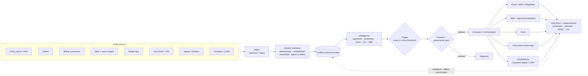
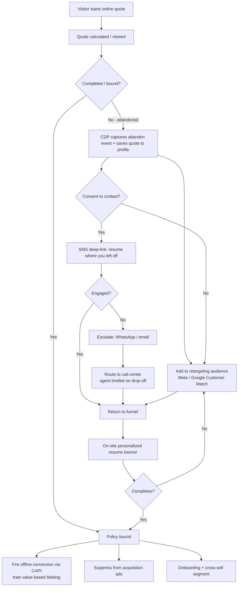

# CDP-in-insurance — workflow diagrams

Mermaid diagrams (render natively on GitHub). Companion to `CDP-in-insurance-landscape.md` and `CDP-insurance-use-cases.xlsx`.

## 1. CDP operating loop (insurance)

How data flows through a CDP and back: sources → ingest → identity resolution → unified profile → intelligence → trigger → consent gate → activation → measurement → feedback.

## 2. Quote-abandonment recovery + retargeting flow

The drop-off recovery loop: detect abandon → owned-channel recovery (resume link → escalate → call-center) in parallel with paid retargeting → on bind, fire offline conversion + suppress.

